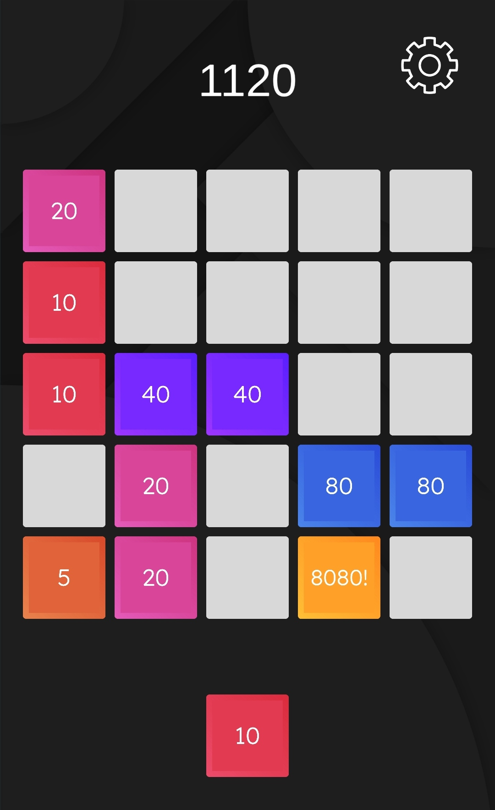

# 8080

This is a puzzle and strategy game where you aim to arrange randomly incoming blocks of sizes 5, 10, 20, 40, 80, and 8080 in a 5x5 grid.

The blocks transform to the next one based on their values if at least three blocks of the same value are adjacent in the grid. For instance, you can merge three 5 blocks into one 10 block.

The objective of the game is to continuously clear and replace blocks to make room for new ones. It requires a combination of puzzle-solving skills and strategic thinking to maximize your score and keep the game going. The challenge lies in efficiently managing the available space on the grid and making strategic decisions on when to merge blocks. Enjoy the thrill of breaking and replacing blocks as you aim for higher scores and a more organized grid.

## In-Game Screenshot

